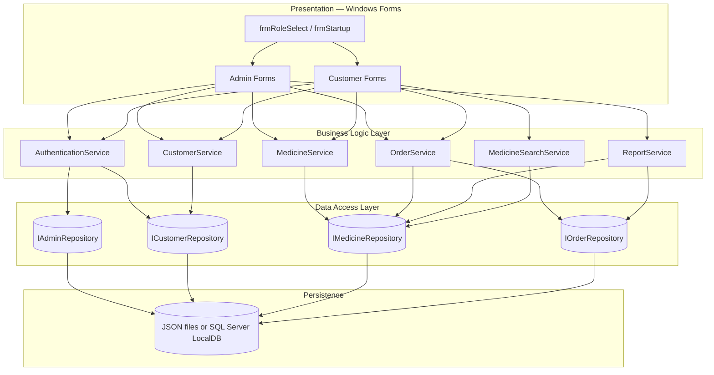
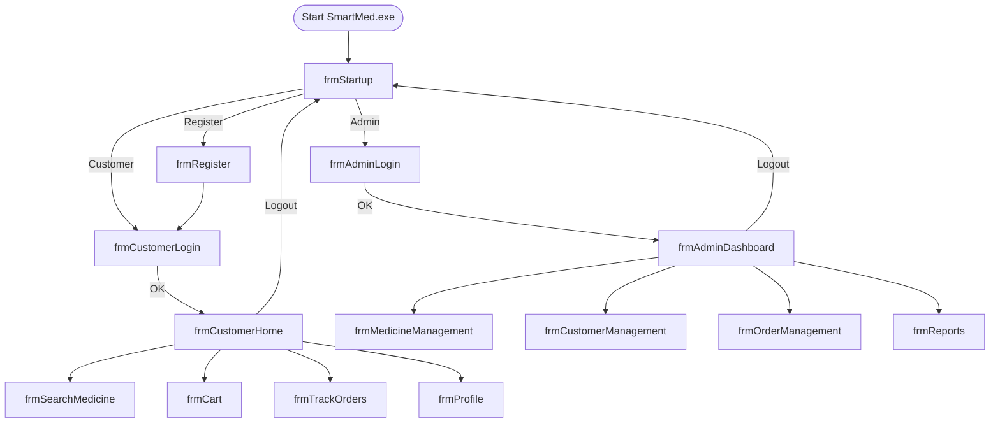

# System Architecture — SmartMed

**Module:** CS6004ES Individual Coursework  
**Status:** Design phase only (no implementation)  
**Source of truth:** [Document.md](../../Document.md)

---

## 1. Requirement compliance

| Document requirement | Architectural decision |
|---------------------|------------------------|
| C# .NET Framework WinForms | Single desktop executable; all UI in `Forms/` |
| Visual Studio 2015+ | Target .NET Framework 4.5.2+ (VS2015 compatible) |
| Core classes: Medicine, Customer, Order, Admin | `Models/` namespace; BLL uses same types |
| Local SQL Server or XML/JSON | `IDataStore` + one implementation (JSON recommended for CW simplicity) |
| Separate Admin / Customer forms | Distinct form sets; shared `Program.cs` entry only |
| Dashboard / navigation menu | `frmAdminDashboard`, `frmCustomerHome` as hubs |
| Validation & exceptions | `ValidationHelper` + `GlobalExceptionHandler` in UI/BLL |
| Search algorithms | `MedicineSearchService` in BLL (linear, filter, sort) |
| Optional: discounts, expiry, prescription, export | Extension services; not in MVP build order |

---

## 2. Logical architecture (three tiers)



### Layer responsibilities

| Layer | Responsibility | Must not |
|-------|----------------|----------|
| **Presentation** | WinForms, user input, display grids, menus | Contain SQL or file I/O |
| **BLL** | Rules, search, status changes, stock checks | Reference `System.Windows.Forms` |
| **DAL** | Load/save entities | Contain UI logic |
| **Persistence** | `medicines.json`, `customers.json`, `orders.json`, `admins.json` *or* SQL tables | — |

---

## 3. Deployment view


- Single-user desktop; no web server.  
- Data path via `App.config` (e.g. `DataFolder`).

---

## 4. UI architecture (Marking: Application UI design)

Per brief: *window-based forms*, *separate Admin and Customer tasks*, *navigation menu/dashboard*.

### 4.1 Application flow



### 4.2 Form inventory (maps to marking tasks)

| Form | Role | Marking task |
|------|------|----------------|
| `frmStartup` | Choose Admin / Customer / Register | UI design |
| `frmAdminLogin` | Admin credentials | Task 1 |
| `frmCustomerLogin` | Customer credentials | Task 1 |
| `frmRegister` | New customer account | Task 2 |
| `frmAdminDashboard` | KPIs + navigation | Task 10 |
| `frmMedicineManagement` | Medicine CRUD | Task 3 |
| `frmCustomerManagement` | View/update customers | Task 4 |
| `frmOrderManagement` | All orders, update status | Task 5 |
| `frmReports` | Sales, stock, order history | Task 9 |
| `frmCustomerHome` | Customer menu | UI design |
| `frmSearchMedicine` | Search by name/category/price | Task 6 |
| `frmCart` | Cart + place order | Task 7 |
| `frmTrackOrders` | Customer order status | Task 8 |
| `frmProfile` | Update personal/contact details | Customer profile |

### 4.3 Admin dashboard (Task 10)

Display on load (from `ReportService` / aggregates):

- **Total sales** (sum of delivered/ all orders per brief interpretation — document in essay)  
- **Medicines in stock** (count or sum of `Stock` where &gt; 0)  
- **Active orders** (status = Pending or Ready for Pickup)

### 4.4 Validation & exception handling (mandatory)

| Location | Behaviour |
|----------|-----------|
| All forms | `ErrorProvider` for empty/invalid fields; numeric validation for price, stock, quantity |
| BLL | Throw `ArgumentException` / custom `BusinessRuleException` for invalid operations |
| UI | `try/catch` on service calls → `MessageBox` user-friendly message; log optional |
| Global | `Application.ThreadException` handler to prevent unhandled crash |

---

## 5. Solution / project structure (Visual Studio)

```
SmartMed.sln
└── SmartMed/
    ├── Program.cs
    ├── App.config
    ├── Forms/
    │   ├── frmStartup.cs
    │   ├── Admin/
    │   │   ├── frmAdminLogin.cs
    │   │   ├── frmAdminDashboard.cs
    │   │   ├── frmMedicineManagement.cs
    │   │   ├── frmCustomerManagement.cs
    │   │   ├── frmOrderManagement.cs
    │   │   └── frmReports.cs
    │   └── Customer/
    │       ├── frmCustomerLogin.cs
    │       ├── frmRegister.cs
    │       ├── frmCustomerHome.cs
    │       ├── frmSearchMedicine.cs
    │       ├── frmCart.cs
    │       ├── frmTrackOrders.cs
    │       └── frmProfile.cs
    ├── Models/
    │   ├── Admin.cs
    │   ├── Customer.cs
    │   ├── Medicine.cs
    │   ├── Order.cs
    │   ├── OrderLine.cs
    │   └── OrderStatus.cs
    ├── Services/
    │   ├── AuthenticationService.cs
    │   ├── MedicineService.cs
    │   ├── CustomerService.cs
    │   ├── OrderService.cs
    │   ├── ReportService.cs
    │   └── MedicineSearchService.cs
    ├── Data/
    │   ├── IAdminRepository.cs
    │   ├── ICustomerRepository.cs
    │   ├── IMedicineRepository.cs
    │   ├── IOrderRepository.cs
    │   └── Json/   (or Sql/)
    └── Utils/
        ├── ValidationHelper.cs
        └── ExceptionHelper.cs
```

---

## 6. Optional features (extension points)

| Feature | Component | Layer |
|---------|-----------|-------|
| Discounts / promotions | `PromotionService` | BLL |
| Expiry notifications | `ExpiryAlertService` | BLL → admin dashboard message |
| Prescription upload | `frmPrescriptionUpload` + file storage | UI + DAL |
| Export PDF/Excel | `ExportService` implementing `IReportExporter` | BLL |

Build order after MVP: Tasks 1–10 first, then optional features.

---

## 7. Technology stack (locked)

| Item | Choice | Rationale |
|------|--------|-----------|
| UI | Windows Forms | Required by brief |
| Framework | .NET Framework 4.7.2 | VS2015+ compatible |
| Data (MVP) | JSON files | Meets “XML/JSON for simplicity” |
| Data (alternative) | SQL Server LocalDB | Meets “SQL Server” option |
| Patterns | Repository + service layer | Clear separation for essay architecture section |
