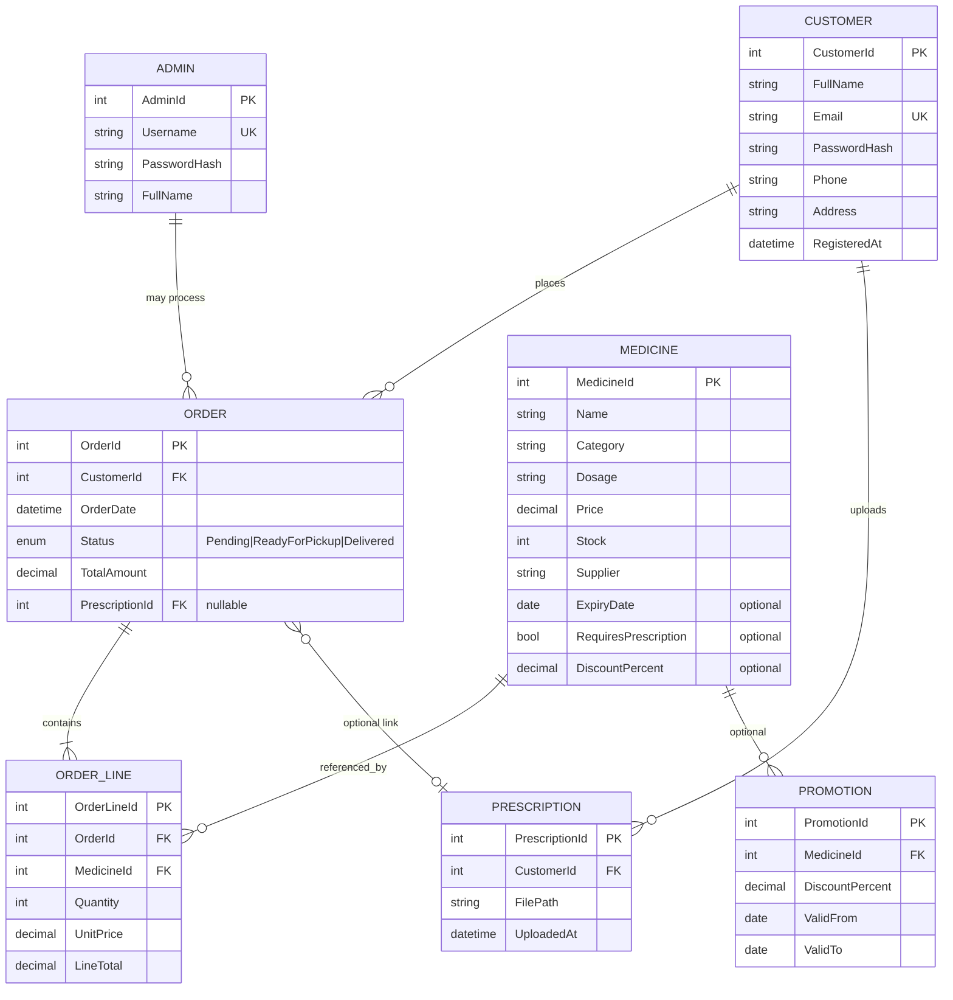

# Entity–Relationship Diagram — SmartMed

**Module:** CS6004ES  
**Source of truth:** [Document.md](../../Document.md)  
**Status:** Design phase

---

## 1. Scope

### Mandatory (core coursework entities)

| Entity | Attributes from brief |
|--------|----------------------|
| **ADMIN** | Credentials for secure login |
| **CUSTOMER** | Registration, login, profile (personal + contact) |
| **MEDICINE** | **name, category, dosage, price, stock, supplier** |
| **ORDER** | Customer orders; status **Pending**, **Ready for Pickup**, **Delivered** |

### Supporting (required for order & cart behaviour)

| Entity | Purpose |
|--------|---------|
| **ORDER_LINE** | Line items (medicine, quantity, price at order time) |

### Optional extensions (additional features in brief)

| Entity | Feature |
|--------|---------|
| **PROMOTION** | Discounts on medicines |
| **PRESCRIPTION** | Upload for restricted medicines |

---

## 2. Primary ER diagram (coursework-aligned)

> **Note:** `Category` and `Supplier` are **string attributes on MEDICINE** per the brief (not separate tables in the minimum model). Normalisation to `CATEGORY` / `SUPPLIER` tables is optional if SQL storage is chosen.

---

## 3. Order status (fixed values)

| Stored value | UI label (brief) |
|--------------|------------------|
| `Pending` | Pending |
| `ReadyForPickup` | Ready for Pickup |
| `Delivered` | Delivered |

Admin updates status (Task 5). Customer views status (Task 8).

---

## 4. Relationships

| From | To | Cardinality | Rule |
|------|-----|-------------|------|
| CUSTOMER | ORDER | 1:N | One customer, many orders |
| ORDER | ORDER_LINE | 1:N | At least one line per order |
| MEDICINE | ORDER_LINE | 1:N | Medicine appears on many lines |
| CUSTOMER | PRESCRIPTION | 1:N | Optional uploads |
| ORDER | PRESCRIPTION | N:0..1 | When order contains prescription-only medicine |
| MEDICINE | PROMOTION | 1:N | Optional active promotion |

---

## 5. Persistence mapping

### JSON files (recommended MVP)

| File | Entities |
|------|----------|
| `admins.json` | ADMIN |
| `customers.json` | CUSTOMER |
| `medicines.json` | MEDICINE |
| `orders.json` | ORDER + ORDER_LINE (embedded or separate `orderlines.json`) |
| `prescriptions.json` | PRESCRIPTION (optional) |

### SQL tables (alternative)

Same entities as tables: `Admin`, `Customer`, `Medicine`, `Order`, `OrderLine`, plus optional `Prescription`, `Promotion`.

---

## 6. Indexes / access patterns

| Task | Query pattern | Index / approach |
|------|---------------|------------------|
| Task 1 — Login | Customer by email; Admin by username | Unique on `Email`, `Username` |
| Task 3 — Medicine CRUD | By `MedicineId` | PK |
| Task 6 — Search | Name, category, price range | Scan + filter (see class diagram) |
| Task 5/8 — Orders | By customer; by status | `CustomerId`, `Status` |
| Task 9 — Reports | Orders by date; stock list | `OrderDate`; full medicine list |
| Task 10 — Dashboard | Aggregates on orders & medicine | In-memory aggregate from loaded data |

---

## 7. Traceability to functional requirements

| Brief feature | ER support |
|---------------|------------|
| Manage medicine (6 fields) | `MEDICINE` attributes |
| Manage customer | `CUSTOMER` |
| Manage orders (3 statuses) | `ORDER.Status` |
| Place / track orders | `ORDER`, `ORDER_LINE` |
| Reports | `ORDER`, `MEDICINE` |
| Discounts | `PROMOTION` / `DiscountPercent` |
| Expiry notifications | `MEDICINE.ExpiryDate` |
| Prescription upload | `PRESCRIPTION` |
