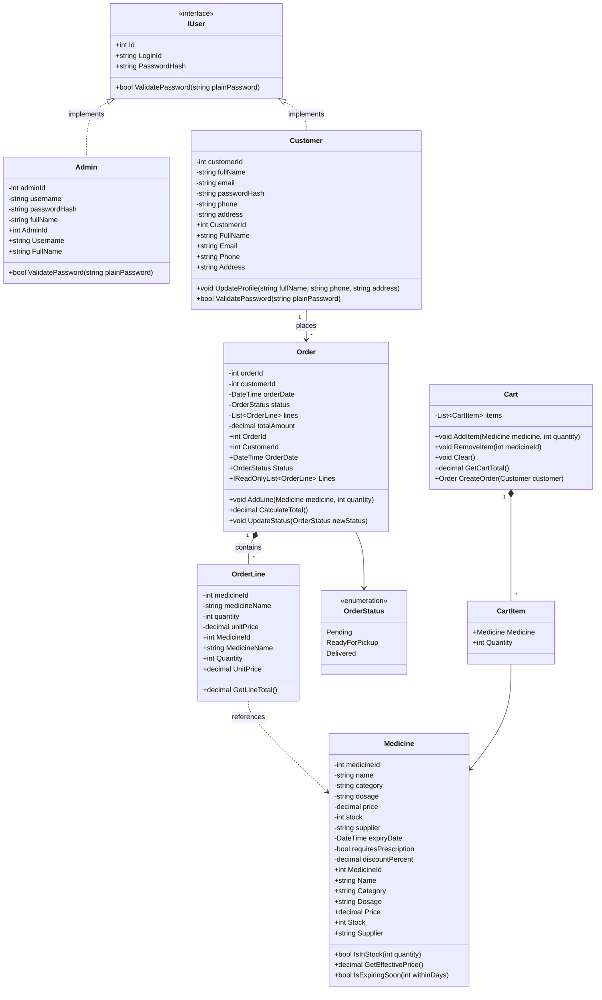
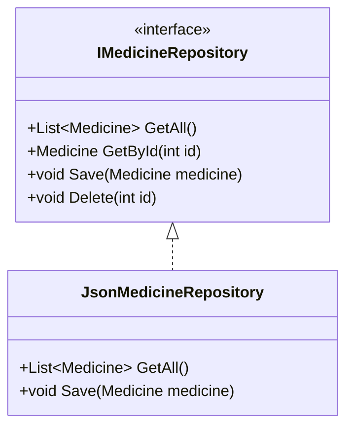

# Class Diagram — SmartMed

**Module:** CS6004ES  
**Source of truth:** [Document.md](../../Document.md)  
**Status:** Design phase — supports reflective essay sections **(b) architecture**, **(c) properties & methods**, **(d) search algorithms**

---

## 1. Core domain classes (mandatory)

Brief requires classes: **`Medicine`**, **`Customer`**, **`Order`**, **`Admin`** with appropriate properties, methods, and inheritance/interfaces where suitable.

### 1.1 Class diagram



---

## 2. Properties and methods (essay section c)

### Admin

| Property | Type | Description |
|----------|------|-------------|
| `AdminId` | `int` | Primary key |
| `Username` | `string` | Login name |
| `PasswordHash` | `string` | Stored hash (not plain text) |
| `FullName` | `string` | Display name |

| Method | Returns | Description |
|--------|---------|-------------|
| `ValidatePassword(plainPassword)` | `bool` | Verifies login password |

### Customer

| Property | Type | Description |
|----------|------|-------------|
| `CustomerId` | `int` | Primary key |
| `FullName` | `string` | Personal detail |
| `Email` | `string` | Login ID (unique) |
| `PasswordHash` | `string` | Stored hash |
| `Phone` | `string` | Contact |
| `Address` | `string` | Contact / delivery |

| Method | Returns | Description |
|--------|---------|-------------|
| `UpdateProfile(...)` | `void` | Profile management (customer feature) |
| `ValidatePassword(plainPassword)` | `bool` | Login verification |

### Medicine

| Property | Type | Brief field |
|----------|------|-------------|
| `MedicineId` | `int` | — |
| `Name` | `string` | name |
| `Category` | `string` | category |
| `Dosage` | `string` | dosage |
| `Price` | `decimal` | price |
| `Stock` | `int` | stock |
| `Supplier` | `string` | supplier |
| `ExpiryDate` | `DateTime` | Optional — expiry notifications |
| `RequiresPrescription` | `bool` | Optional — prescription medicines |
| `DiscountPercent` | `decimal` | Optional — promotions |

| Method | Returns | Description |
|--------|---------|-------------|
| `IsInStock(quantity)` | `bool` | Task 7 — stock check before order |
| `GetEffectivePrice()` | `decimal` | Price after discount |
| `IsExpiringSoon(withinDays)` | `bool` | Optional expiry alert |

### Order

| Property | Type | Description |
|----------|------|-------------|
| `OrderId` | `int` | Primary key |
| `CustomerId` | `int` | FK to customer |
| `OrderDate` | `DateTime` | When placed |
| `Status` | `OrderStatus` | Pending / ReadyForPickup / Delivered |
| `Lines` | `List<OrderLine>` | Items ordered |
| `TotalAmount` | `decimal` | Sum of line totals |

| Method | Returns | Description |
|--------|---------|-------------|
| `AddLine(medicine, quantity)` | `void` | Add item; snapshot `UnitPrice` |
| `CalculateTotal()` | `decimal` | Recalculate order total |
| `UpdateStatus(newStatus)` | `void` | Task 5 — admin status change |

### OrderLine (supporting)

| Property | Type | Description |
|----------|------|-------------|
| `MedicineId` | `int` | Reference |
| `MedicineName` | `string` | Snapshot for history |
| `Quantity` | `int` | Units ordered |
| `UnitPrice` | `decimal` | Price at time of order |

| Method | Returns | Description |
|--------|---------|-------------|
| `GetLineTotal()` | `decimal` | `Quantity * UnitPrice` |

---

## 3. Inheritance and interfaces (brief requirement)

| Type | Purpose |
|------|---------|
| `IUser` | Shared contract for `Admin` and `Customer` authentication |
| `OrderStatus` enum | Type-safe order workflow (3 values from brief) |
| `IMedicineRepository`, `IOrderRepository`, etc. | Swap JSON vs SQL storage without changing BLL |



---

## 4. Application services (BLL)

```mermaid
classDiagram
    class AuthenticationService {
        -IAdminRepository adminRepo
        -ICustomerRepository customerRepo
        +Admin LoginAdmin(string username, string password)
        +Customer LoginCustomer(string email, string password)
        +Customer Register(string fullName, string email, string password, string phone, string address)
    }

    class MedicineService {
        -IMedicineRepository repo
        +void Add(Medicine m)
        +void Update(Medicine m)
        +void Delete(int id)
        +Medicine GetById(int id)
        +List~Medicine~ GetAll()
    }

    class CustomerService {
        -ICustomerRepository repo
        +List~Customer~ GetAll()
        +Customer GetById(int id)
        +void Update(Customer c)
    }

    class OrderService {
        -IOrderRepository orderRepo
        -IMedicineRepository medicineRepo
        +Order PlaceOrder(Customer customer, Cart cart)
        +void UpdateStatus(int orderId, OrderStatus status)
        +List~Order~ GetByCustomer(int customerId)
        +List~Order~ GetAll()
        +bool CheckStock(int medicineId, int quantity)
    }

    class MedicineSearchService {
        +List~Medicine~ SearchByName(List~Medicine~ source, string name)
        +List~Medicine~ FilterByCategory(List~Medicine~ source, string category)
        +List~Medicine~ FilterByPriceRange(List~Medicine~ source, decimal min, decimal max)
        +List~Medicine~ SortByPrice(List~Medicine~ source, bool ascending)
        +Medicine BinarySearchByName(List~Medicine~ sortedByName, string name)
    }

    class ReportService {
        +decimal GetTotalSales()
        +int GetMedicinesInStockCount()
        +int GetActiveOrdersCount()
        +SalesReport GetSalesReport(DateTime from, DateTime to)
        +StockReport GetStockReport()
        +List~Order~ GetCustomerOrderHistory(int customerId)
    }
```



| Service | Marking task |
|---------|----------------|
| `AuthenticationService` | Tasks 1, 2 |
| `MedicineService` | Task 3 |
| `CustomerService` | Task 4 |
| `OrderService` | Tasks 5, 7, 8 |
| `MedicineSearchService` | Task 6 |
| `ReportService` | Tasks 9, 10 |

---

## 5. Search algorithms (essay section d)

**Brief:** implement search algorithms (e.g. linear search, filtering, sorting); optional binary search for sorted lists.

### 5.1 Algorithms used

| Algorithm | Used in | Purpose | Complexity |
|-----------|---------|---------|------------|
| **Linear search** | `SearchByName` | Find medicines whose name contains search term | O(n) |
| **Filtering** | `FilterByCategory`, `FilterByPriceRange` | Match category or price bounds | O(n) |
| **Sorting** | `SortByPrice` | Order results for display | O(n log n) typical |
| **Binary search** (optional) | `BinarySearchByName` | Exact match on list sorted by name | O(log n) |

### 5.2 Task 6 flow

1. Load all medicines from `MedicineService.GetAll()`.  
2. Apply **filter** (category and/or price range) → O(n).  
3. Apply **linear search** on name if search text provided → O(n).  
4. **Sort** by price if user selects sort → O(n log n).  
5. Bind result to `DataGridView` on `frmSearchMedicine`.

### 5.3 Pseudocode (linear search by name)

```
function SearchByName(medicines, searchText):
    results = empty list
    searchText = lowercase(trim(searchText))
    for each medicine in medicines:
        if lowercase(medicine.Name) contains searchText:
            results.add(medicine)
    return results
```

### 5.4 Pseudocode (optional binary search — exact name match)

Precondition: `medicines` sorted by `Name` ascending.

```
function BinarySearchByName(sortedMedicines, targetName):
    low = 0
    high = sortedMedicines.Count - 1
    targetName = lowercase(trim(targetName))
    while low <= high:
        mid = (low + high) / 2
        name = lowercase(sortedMedicines[mid].Name)
        if name == targetName: return sortedMedicines[mid]
        if name < targetName: low = mid + 1
        else: high = mid - 1
    return null
```

### 5.5 Programming style alignment

- Implement search in `MedicineSearchService` so code **clearly shows the algorithm** (marking: programming style).  
- Use meaningful names: `SearchByName`, `FilterByPriceRange`.  
- Comment preconditions for binary search (sorted list required).

---

## 6. Traceability matrix

| Brief / marking item | Class(es) |
|----------------------|-----------|
| Core entities | `Medicine`, `Customer`, `Order`, `Admin` |
| Inheritance/interfaces | `IUser`, repositories |
| Admin login | `Admin`, `AuthenticationService` |
| Customer register/login | `Customer`, `AuthenticationService` |
| Medicine CRUD | `Medicine`, `MedicineService` |
| Orders + status | `Order`, `OrderStatus`, `OrderService` |
| Cart / place order | `Cart`, `CartItem`, `OrderService` |
| Search | `MedicineSearchService` |
| Dashboard / reports | `ReportService` |
