# Use Case Diagram — SmartMed

**Module:** CS6004ES  
**Source of truth:** [Document.md](../../Document.md)  
**Status:** Design phase

---

## 1. Actors

| Actor | Description |
|-------|-------------|
| **Admin** | Manages medicines, customers, orders, reports; uses dashboard |
| **Customer** | Registers, logs in, searches, orders, tracks orders, updates profile |
| **System** | Validation, expiry alerts (optional) |

---

## 2. Use case diagram

```mermaid
flowchart TB
    Admin((Admin))
    Customer((Customer))
    System((System))

    subgraph Mandatory["Mandatory — functional requirements"]
        UC_A1[UC-A1 Secure Admin Login]
        UC_A2[UC-A2 Manage Medicine Details]
        UC_A3[UC-A3 Manage Customer Details]
        UC_A4[UC-A4 Manage Orders]
        UC_A5[UC-A5 Generate Reports]
        UC_A6[UC-A6 Admin Dashboard]
        UC_C1[UC-C1 Customer Registration]
        UC_C2[UC-C2 Customer Login]
        UC_C3[UC-C3 Search Medicines]
        UC_C4[UC-C4 Place Order]
        UC_C5[UC-C5 Track Orders]
        UC_C6[UC-C6 Profile Management]
    end

    subgraph Optional["Optional — additional features"]
        UC_O1[UC-O1 Apply Discount or Promotion]
        UC_O2[UC-O2 Prescription Upload]
        UC_O3[UC-O3 Export Order History]
        UC_O4[UC-O4 Expiry Notification]
    end

    Admin --> UC_A1 & UC_A2 & UC_A3 & UC_A4 & UC_A5 & UC_A6
    Customer --> UC_C1 & UC_C2 & UC_C3 & UC_C4 & UC_C5 & UC_C6
    Admin --> UC_O1
    Customer --> UC_O2 & UC_O3
    System --> UC_O4
```

---

## 3. Mapping to marking scheme (implementation)

| Marking # | Marking item | Use case ID | Actor |
|-----------|--------------|-------------|-------|
| — | Application UI design | All forms in [01-architecture.md](01-architecture.md) §4 | Admin, Customer |
| 1 | Customer, Admin Login | UC-A1, UC-C2 | Admin, Customer |
| 2 | Customer Registration | UC-C1 | Customer |
| 3 | Admin: Manage Medicine Details | UC-A2 | Admin |
| 4 | Admin: Manage Customer Details | UC-A3 | Admin |
| 5 | Admin: Manage Orders | UC-A4 | Admin |
| 6 | Customer: Search Medicines | UC-C3 | Customer |
| 7 | Customer: Place Orders | UC-C4 | Customer |
| 8 | Customer: Track Orders | UC-C5 | Customer |
| 9 | Admin: Generate Reports | UC-A5 | Admin |
| 10 | Admin Dashboard | UC-A6 | Admin |

---

## 4. Use case specifications

### UC-A1 — Secure Admin Login (Task 1)

| | |
|-|-|
| **Actor** | Admin |
| **Precondition** | Admin record exists in data store |
| **Main flow** | 1. Open `frmAdminLogin` → 2. Enter username/password → 3. System validates (non-empty, correct credentials) → 4. Open `frmAdminDashboard` |
| **Alternate** | 3a. Invalid credentials → show error, remain on login form |
| **Postcondition** | Admin session active |

### UC-C2 — Customer Login (Task 1)

| | |
|-|-|
| **Actor** | Customer |
| **Precondition** | Customer registered |
| **Main flow** | 1. `frmCustomerLogin` → 2. Email/password → 3. Validate → 4. `frmCustomerHome` |
| **Alternate** | 3a. Invalid login → error message |
| **Postcondition** | Customer session active |

### UC-C1 — Customer Registration (Task 2)

| | |
|-|-|
| **Actor** | Customer |
| **Precondition** | Email not already registered |
| **Main flow** | 1. `frmRegister` → 2. Enter full name, email, password, phone, address → 3. Validate → 4. Save customer → 5. Redirect to login |
| **Postcondition** | New customer stored |

### UC-A2 — Manage Medicine Details (Task 3)

| | |
|-|-|
| **Actor** | Admin |
| **Precondition** | Admin logged in |
| **Main flow** | **Add:** enter name, category, dosage, price, stock, supplier → save. **Update:** select row → edit → save. **Delete:** select → confirm → remove |
| **Postcondition** | Medicine catalogue updated |

### UC-A3 — Manage Customer Details (Task 4)

| | |
|-|-|
| **Actor** | Admin |
| **Precondition** | Admin logged in |
| **Main flow** | 1. List customers → 2. Select customer → 3. View/edit details → 4. Save |
| **Postcondition** | Customer record updated |

### UC-A4 — Manage Orders (Task 5)

| | |
|-|-|
| **Actor** | Admin |
| **Precondition** | Admin logged in |
| **Main flow** | 1. View all orders → 2. Select order → 3. Set status: Pending / Ready for Pickup / Delivered → 4. Save |
| **Postcondition** | Order status persisted |

### UC-C3 — Search Medicines (Task 6)

| | |
|-|-|
| **Actor** | Customer |
| **Precondition** | Customer logged in |
| **Main flow** | 1. Enter name and/or category and/or price range → 2. Run search (linear + filter + optional sort) → 3. Display results |
| **Postcondition** | Filtered medicine list shown |

### UC-C4 — Place Order (Task 7)

| | |
|-|-|
| **Actor** | Customer |
| **Precondition** | Logged in; cart has items; stock available |
| **Main flow** | 1. Search → add to cart → 2. `frmCart` review → 3. Place order → 4. Order status = Pending |
| **Alternate** | 3a. Insufficient stock → message, no order |
| **Postcondition** | Order and order lines saved; stock reduced |

### UC-C5 — Track Orders (Task 8)

| | |
|-|-|
| **Actor** | Customer |
| **Precondition** | Logged in |
| **Main flow** | 1. `frmTrackOrders` → 2. Load customer's orders → 3. Display status |
| **Postcondition** | Customer sees current status |

### UC-A5 — Generate Reports (Task 9)

| | |
|-|-|
| **Actor** | Admin |
| **Precondition** | Admin logged in |
| **Main flow** | 1. Select report: **sales** / **stock** / **customer order history** → 2. Set filters if needed → 3. Generate → 4. Display (optional export) |
| **Postcondition** | Report shown |

### UC-A6 — Admin Dashboard (Task 10)

| | |
|-|-|
| **Actor** | Admin |
| **Precondition** | Admin logged in |
| **Main flow** | 1. Open dashboard → 2. Show **total sales**, **medicines in stock**, **active orders** → 3. Navigate to other admin functions |
| **Postcondition** | KPIs visible |

### UC-C6 — Profile Management

| | |
|-|-|
| **Actor** | Customer |
| **Precondition** | Logged in |
| **Main flow** | 1. `frmProfile` → 2. Update personal/contact fields → 3. Validate → 4. Save |
| **Postcondition** | Profile updated |

---

## 5. Optional use cases

| ID | Feature (brief) | Actor |
|----|-----------------|-------|
| UC-O1 | Apply discounts or promotions | Admin (set), Customer (see price) |
| UC-O2 | Prescription upload for certain medicines | Customer |
| UC-O3 | Export order history PDF/Excel | Customer / Admin |
| UC-O4 | Expiry tracking notifications | System → Admin dashboard |

Implement after Tasks 1–10 are complete.

---

## 6. Documentation use cases (reflective essay — not coded in CW1 design)

| Essay section | Design artefact |
|---------------|-----------------|
| Run instructions | README + future essay |
| Software architecture | [01-architecture.md](01-architecture.md), [03-class-diagram.md](03-class-diagram.md) |
| Class properties & methods | [03-class-diagram.md](03-class-diagram.md) §2 |
| Search algorithms | [03-class-diagram.md](03-class-diagram.md) §5 |
| Reflection | Student essay (post-implementation) |
