# Sequence Diagrams — SmartMed

**Module:** CS6004ES  
**Source of truth:** [Document.md](../../Document.md)  
**Status:** Design phase — one diagram per major **marking task**

Forms and services match [01-architecture.md](01-architecture.md). Validation and exception handling shown where required by brief.

---

## Task 1 — Admin login (UC-A1)

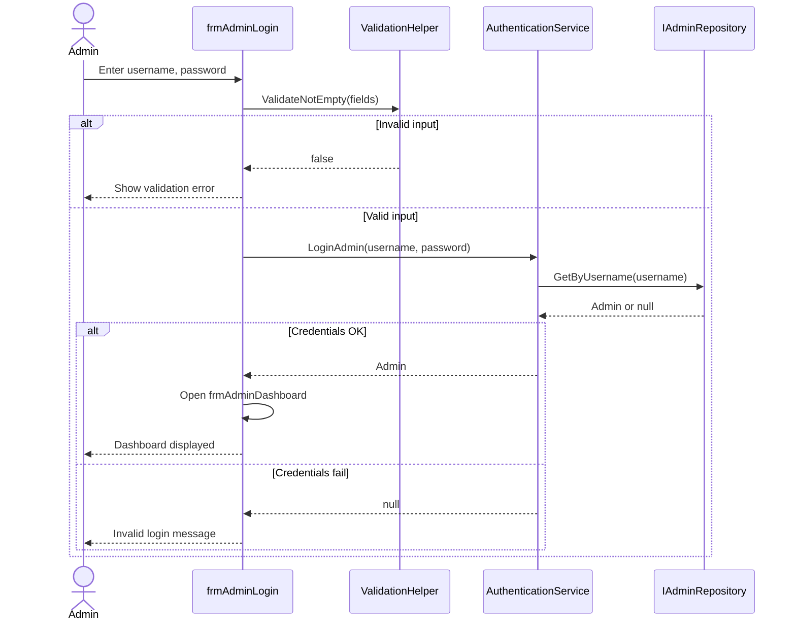

---

## Task 1 — Customer login (UC-C2)

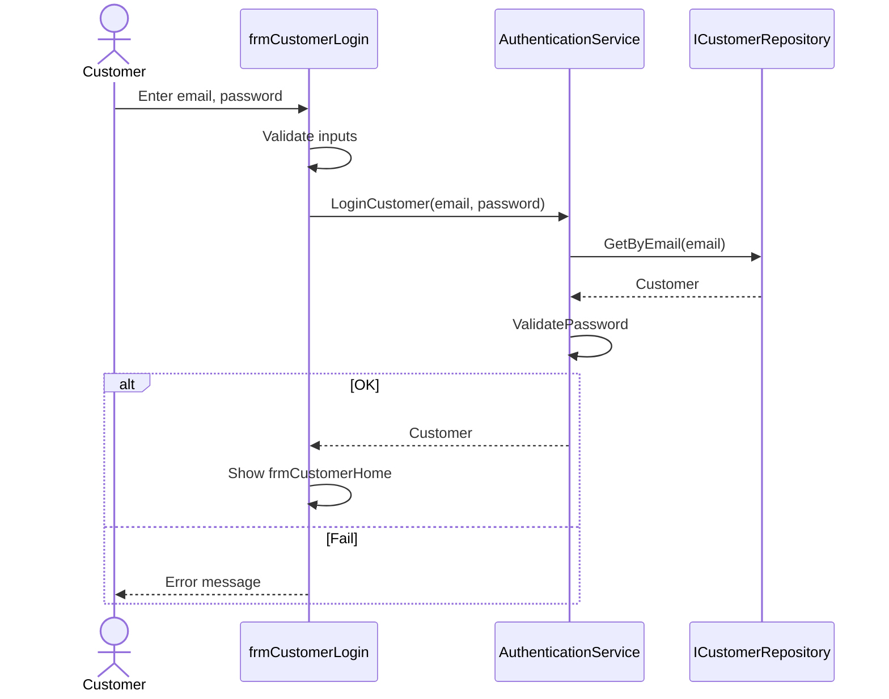

---

## Task 2 — Customer registration (UC-C1)

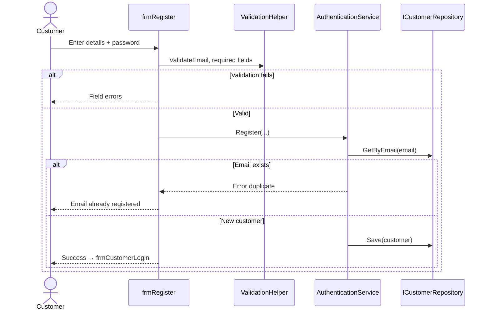

---

## Task 3 — Admin manage medicine (UC-A2)

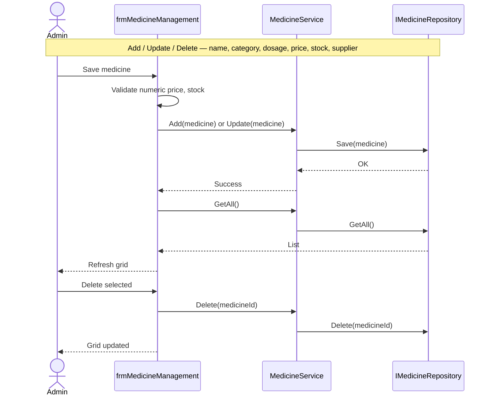

---

## Task 4 — Admin manage customer (UC-A3)

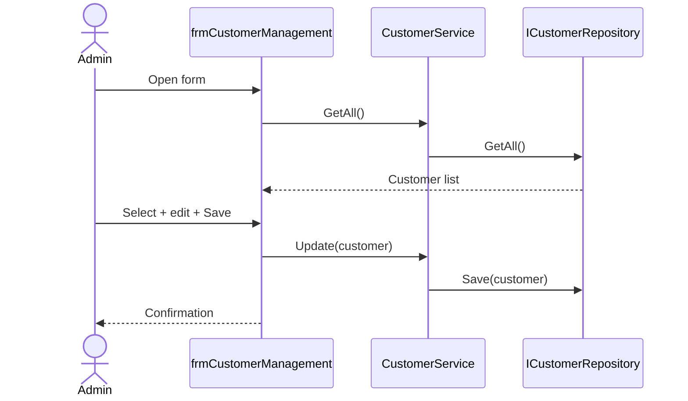

---

## Task 5 — Admin manage orders (UC-A4)

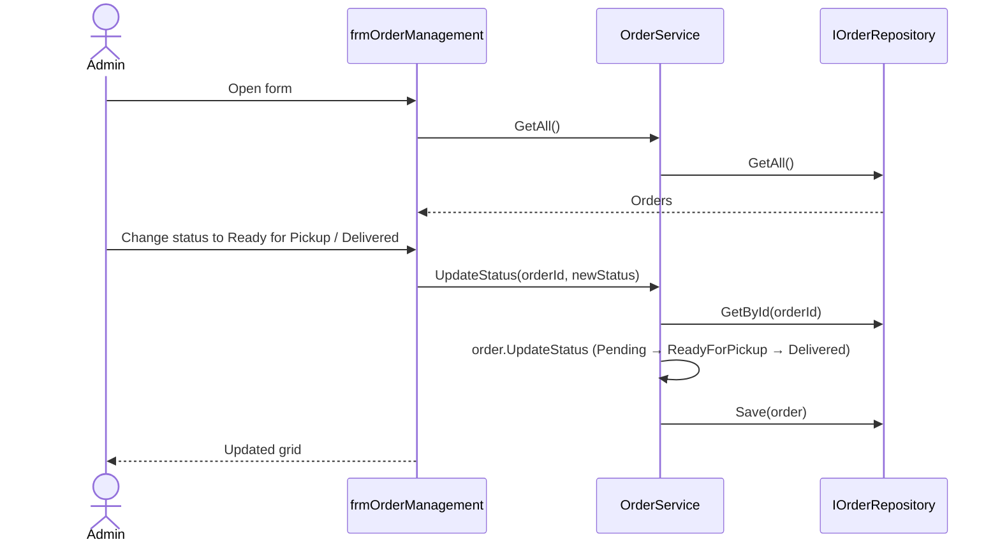

---

## Task 6 — Customer search medicines (UC-C3)

Uses **linear search**, **filtering**, and **sorting** per brief.

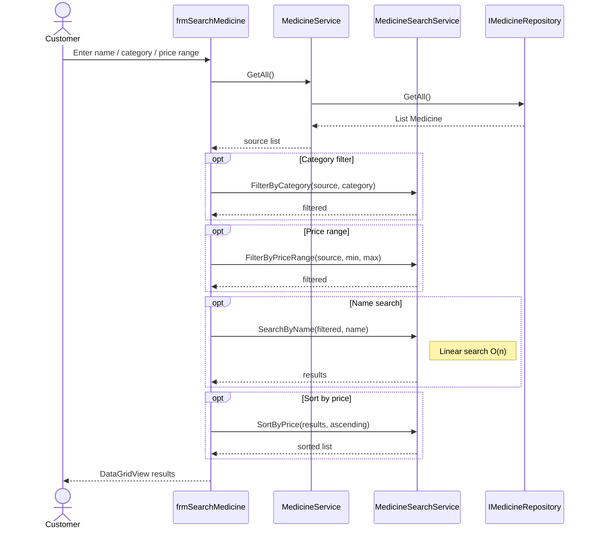

---

## Task 7 — Customer place order (UC-C4)

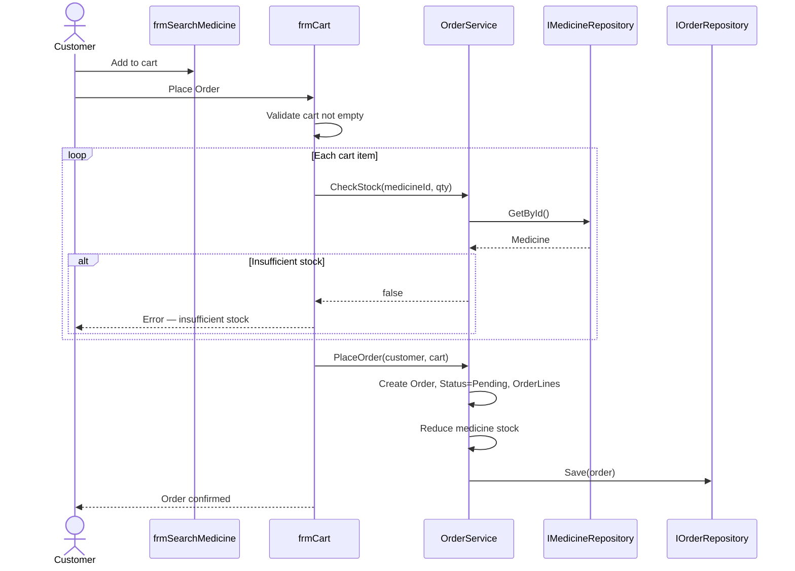

---

## Task 8 — Customer track orders (UC-C5)

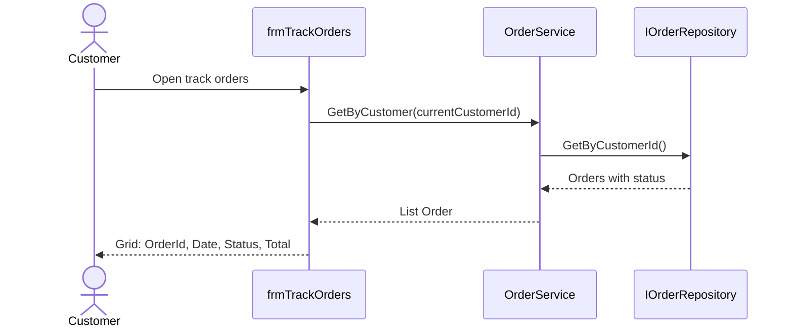

---

## Task 9 — Admin generate reports (UC-A5)

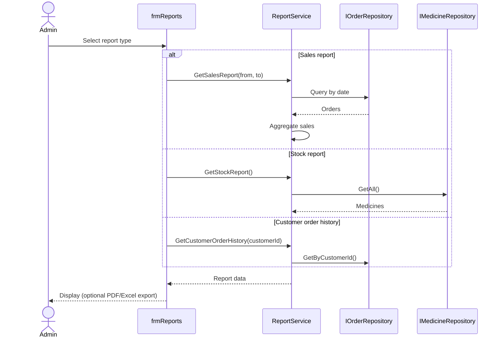

---

## Task 10 — Admin dashboard (UC-A6)

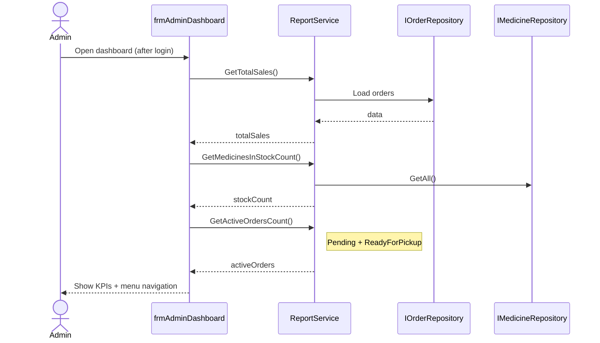

---

## Cross-cutting — Exception handling

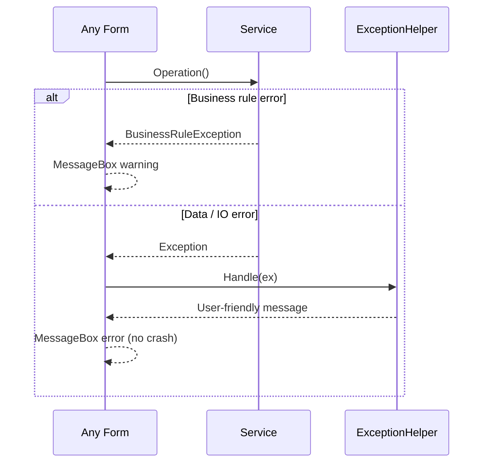

---

## Search algorithms summary

| Diagram | Algorithm |
|---------|-----------|
| Task 6 | Linear search (name), filter (category, price), sort (price) |
| Optional | Binary search on name-sorted list — see [03-class-diagram.md](03-class-diagram.md) §5 |

Document implementation and Big-O analysis in the **reflective essay** (marking: documentation item 4).
